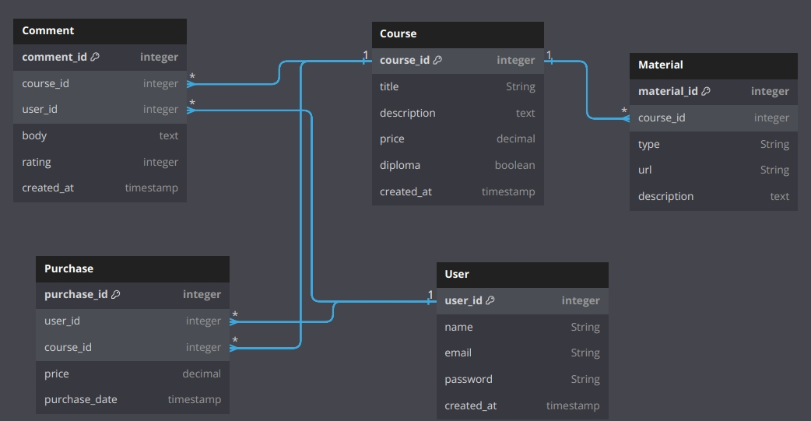

# LibACE

<h2>Index</h2>

- [Introduction](#introduction)
- [Development team](#team)
- [Web features](#features)
    - [Entities](#entities)
    - [User permissions](#permissons)
    - [Images](#images)
    - [Charts](#charts)
    - [Complementary technology](#complementary_technology)
    - [Advanced algorithms](algorithm)
    - [Trello](trello)

 

<h2 id="intro">Introduction</h2>
<h3>LibACE</h3>

LibACE is a web application where you can access courses

 
<h2 id="team">Development team</h2>

| Member | Mail | Git username |
|:-:|:-:|:-:|
|Sergio Rodríguez Gil|s.rodriguezgi.2021@alumnos.urjc.es|[NeoDaru](https://github.com/NeoDaru)|
|David Cereceda Catalán|d.cereceda.2021@alumnos.urjc.es| [DavidCCGithubURJC](https://github.com/DavidCCGithubURJC)|
|Marcos Alejandro Pascual Rojas|ma.pascual.2020@alumnos.urjc.es|[Markos9](https://github.com/Markos9)|
|Sergio Lopez Cuesta|s.lopezc.2018@alumnos.urjc.es|[sergio2000-hub](https://github.com/sergio2000-hub)|
|Gonzalo García Castillo|g.garciac.2022@gmail.com|[g-garciac2022](https://github.com/g-garciac2022)|

 

<h2 id="features">Web Features</h2>

<h3 id="entities">Entities</h3>

**Users**

UNREGISTERED USER: Has the ability to view all available courses on the website, their prices, and the option to log in/register.

REGISTERED USER: In addition to access all available courses, they can access the content of the courses they have purchased and buy more courses. They can also add comments on the courses they have bought and modify their profile.

ADMIN (MANAGE/EDIT COURSES, CREATE/DELETE): Has the ability to add, delete, and modify courses and comments. They also can see the information of all courses.

**Courses**

Users can purchase courses, admins can create, modify and delete courses

**Comment**

The courses have comments, comments can be created by registered users

**Material**

Admins can add materials to the courses

**Purchase**

'Purchase' is an entity that matches users to the courses they have purchased

 

<h3 id="entities_diagram">Entities diagram</h3>

<h3 id="permissons">User permissions</h3>

| Feature | Unregistered User | Registered User | Admin |
|:-:|:-:|:-:|:--|
|See available courses|✅|✅|✅|
|Create courses|❌|❌|✅|
|Edit courses|❌|❌|✅|
|Delete courses|❌|❌|✅|
|Add material to courses|❌|❌|✅|
|Create an account|✅|❌|❌|
|Log in|✅|✅|✅|
|View charts and statistics about courses|✅|✅|✅|
|Delete accounts|❌|❌|✅|
|Purchase courses|❌|✅|❌|
|Complete courses|❌|✅|❌|
|See material of courses|❌|✅|✅|
|Write comments in courses|❌|✅|❌|

<h3 id="images">Images</h3>

**Images of courses**

**User profile pictures**

<h3 id="charts">Charts</h3>

**Number of users chart**

The chart shows the courses with the most users currently

**Best-selling courses chart**

This chart shows the courses that have sold the most

<h3 id="complementary_technology">Complementary technology</h3>

**Generate Diploma PDF**

When the user finish a course, he can generate a Diploma in PDF

<h3 id="algorithm">Advanced algorithms</h3>

**Recomendation system**

An algorithm to recommend courses based on the courses you have already signed up for.

 

<h3 id="trello">Trello</h3>

- [Trello](https://trello.com/b/rYpLm9YG/daw-grupo-3)
