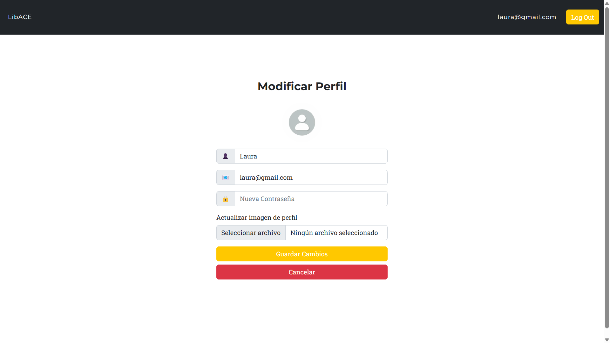

# LibACE

<h2>Index</h2>

- [Introduction](#introduction)
- [Development team](#team)
- [Web features](#features)
  - [Entities](#entities)
  - [User permissions](#permissons)
  - [Images](#images)
  - [Charts](#charts)
  - [Complementary technology](#complementary_technology)
  - [Advanced algorithms](#algorithm)
  - [Trello](#trello)
  - [Screenshots](#screenshots)
  - [Navigation](#navigation)
  - [Classes and Templates Diagram](#classes)
- [Members contribution](#contribution)
- [Execution instructions](#execution)

 

<h2 id="intro">Introduction</h2>
<h3>LibACE</h3>

LibACE is a web application where you can access courses

 
<h2 id="team">Development team</h2>

|             Member             |                Mail                |                       Git username                        |
| :----------------------------: | :--------------------------------: | :-------------------------------------------------------: |
|      Sergio Rodríguez Gil      | s.rodriguezgi.2021@alumnos.urjc.es |           [NeoDaru](https://github.com/NeoDaru)           |
|     David Cereceda Catalán     |  d.cereceda.2021@alumnos.urjc.es   | [DavidCCGithubURJC](https://github.com/DavidCCGithubURJC) |
| Marcos Alejandro Pascual Rojas |  ma.pascual.2020@alumnos.urjc.es   |           [Markos9](https://github.com/Markos9)           |
|      Sergio Lopez Cuesta       |   s.lopezc.2018@alumnos.urjc.es    |    [sergio2000-hub](https://github.com/sergio2000-hub)    |
|    Gonzalo García Castillo     |      g.garciac.2022@gmail.com      |     [g-garciac2022](https://github.com/g-garciac2022)     |

 

<h2 id="features">Web Features</h2>

<h3 id="entities">Entities</h3>

**Users**

UNREGISTERED USER: Has the ability to view all available courses on the website, their prices, and the option to log in/register.

REGISTERED USER: In addition to access all available courses, they can access the content of the courses they have purchased and buy more courses. They can also add comments on the courses they have bought and modify their profile.

ADMIN (MANAGE/EDIT COURSES, CREATE/DELETE): Has the ability to add, delete, and modify courses and comments. They also can see the information of all courses.

**Courses**

Users can purchase courses, admins can create, modify and delete courses

**Comment**

The courses have comments, comments can be created by registered users

**Material**

Admins can add materials to the courses

**Purchase**

'Purchase' is an entity that matches users to the courses they have purchased

 

<h3 id="entities_diagram">Entities diagram</h3>

<h3 id="permissons">User permissions</h3>

|                 Feature                  | Unregistered User | Registered User | Admin |
| :--------------------------------------: | :---------------: | :-------------: | :---- |
|          See available courses           |        ✅         |       ✅        | ✅    |
|              Create courses              |        ❌         |       ❌        | ✅    |
|               Edit courses               |        ❌         |       ❌        | ✅    |
|              Delete courses              |        ❌         |       ❌        | ✅    |
|         Add material to courses          |        ❌         |       ❌        | ✅    |
|            Create an account             |        ✅         |       ❌        | ❌    |
|                  Log in                  |        ✅         |       ✅        | ✅    |
| View charts and statistics about courses |        ✅         |       ✅        | ✅    |
|             Delete accounts              |        ❌         |       ❌        | ✅    |
|              Join a course               |        ❌         |       ✅        | ✅    |
|             Download diploma             |        ❌         |       ✅        | ✅    |
|         See material of courses          |        ❌         |       ✅        | ✅    |
|        Write comments in courses         |        ❌         |       ✅        | ✅    |

<h3 id="images">Images</h3>

**Images of courses**

**User profile pictures**

<h3 id="charts">Charts</h3>

**Number of users chart**

The chart shows the courses with the most users currently

<h3 id="complementary_technology">Complementary technology</h3>

**Generate Diploma PDF**

When the user finish a course, he can generate a Diploma in PDF

<h3 id="algorithm">Advanced algorithms</h3>

**Recomendation system**

An algorithm to recommend courses based on the courses you have already signed up for.

 

<h3 id="trello">Trello</h3>

- [Trello](https://trello.com/b/rYpLm9YG/daw-grupo-3)

<h3 id="screenshots">Screenshots</h3>

<h4 id="index">Index</h4>

<h4 id="login">Login</h4>

<h4 id="register">Register</h4>

<h4 id="createCourse">Create course</h4>

<h4 id="adminUsers">Users list</h4>

<h4 id="course">Course</h4>

<h4 id="profilePage">Profile page</h4>

<h4 id="modifyProfile">Modify profile</h4>

<h4 id="error1">Login error</h4>

<h4 id="error2">Register error</h4>

<h4 id="error3">Course access error</h4>

<h4 id="error4">Generic error</h4>

<h3 id="navigation">Navigation diagram</h3>

<h3 id="classes">Classes and Templates Diagram</h3>

<h3 id="contribution">Members contribution</h3>

<h3>David Cereceda Catalán</h3>

| Commit | Description |
| :----: | :---------: |
|   1º   | Description |
|   2º   | Description |
|   3º   | Description |
|   4º   | Description |
|   5º   | Description |

| File | Name |
| :--: | :--: |
|  1º  | Name |
|  2º  | Name |
|  3º  | Name |
|  4º  | Name |
|  5º  | Name |

<h3>Sergio Rodríguez Gil</h3>

At the beginning of the project I created the repositories and the main controller (which was divided into smaller ones later). Secondly, I modified the class responsible to initialize the database with users, courses, materials and comments. Finally, I implemented functionalities such as modify profile data, modify password, and delete users; apart from fixing some errors along the way meaning.

|                                                 Commit                                                 |                   Description                   |
| :----------------------------------------------------------------------------------------------------: | :---------------------------------------------: |
| [1º](https://github.com/CodeURJC-DAW-2024-25/webapp03/commit/0252236a6c185d1f551e7d4fc3e6412ea142b7fd) |             Implement delete course             |
| [2º](https://github.com/CodeURJC-DAW-2024-25/webapp03/commit/0fd628b7b6e32ba1678d0ed7f92effe353afab4f) |     Implements logic behind adminUsers.html     |
| [3º](https://github.com/CodeURJC-DAW-2024-25/webapp03/commit/52359184a890dd44796740399d71e29aaffb288c) |      Implement edit profile functionality       |
| [4º](https://github.com/CodeURJC-DAW-2024-25/webapp03/commit/fd36af402ef8c0b1669cbb5ea3f34ac43b235a14) |    Implements change password functionality     |
| [5º](https://github.com/CodeURJC-DAW-2024-25/webapp03/commit/81022fb4891dc903e1026835ba120c5d9cf2cbc4) | Initialize database with materials and comments |

|                                                                    File                                                                     |        Name         |
| :-----------------------------------------------------------------------------------------------------------------------------------------: | :-----------------: |
|  [1º](https://github.com/CodeURJC-DAW-2024-25/webapp03/blob/main/backend/src/main/java/es/webapp03/backend/controller/WebController.java)   |    WebController    |
| [2º](https://github.com/CodeURJC-DAW-2024-25/webapp03/blob/main/backend/src/main/java/es/webapp03/backend/service/DatabaseInitializer.java) | DatabaseInitializer |
| [3º](https://github.com/CodeURJC-DAW-2024-25/webapp03/blob/main/backend/src/main/java/es/webapp03/backend/controller/CourseController.java) |  CourseController   |
|  [4º](https://github.com/CodeURJC-DAW-2024-25/webapp03/blob/main/backend/src/main/java/es/webapp03/backend/controller/UserController.java)  |   UserController    |
| [5º](https://github.com/CodeURJC-DAW-2024-25/webapp03/blob/main/backend/src/main/java/es/webapp03/backend/controller/LoginController.java)  |   LoginController   |

<h3>Sergio López Cuesta</h3>

| Commit | Description |
| :----: | :---------: |
|   1º   | Description |
|   2º   | Description |
|   3º   | Description |
|   4º   | Description |
|   5º   | Description |

| File | Name |
| :--: | :--: |
|  1º  | Name |
|  2º  | Name |
|  3º  | Name |
|  4º  | Name |
|  5º  | Name |

<h3>Marcos Alejandro Pascual Rojas</h3>
I implemented the user registration functionality, the course page and the uploading of material to the course. I was also involved in implementing the security of the application. Finally, I configured some error pages.

|                                                 Commit                                                 |                             Description                             |
| :----------------------------------------------------------------------------------------------------: | :-----------------------------------------------------------------: |
| [1º](https://github.com/CodeURJC-DAW-2024-25/webapp03/commit/359f947247d14a215951d4c58b73dabeae0b2410) |             Add material to course and fixed header bug             |
| [2º](https://github.com/CodeURJC-DAW-2024-25/webapp03/commit/556e9e842ccc36e42e0755219e9d21d5325dc3ae) |                     Security and register logic                     |
| [3º](https://github.com/CodeURJC-DAW-2024-25/webapp03/commit/44b7f26d63fdfb1a56010b988e53e1cf04324aee) |              Register user feat, create course button               |
| [4º](https://github.com/CodeURJC-DAW-2024-25/webapp03/commit/471b68fd24354f178cb315c69f0ade3925dc66ea) |                     Added csrf and email login                      |
| [5º](https://github.com/CodeURJC-DAW-2024-25/webapp03/commit/db8f5195af986de2fa56c585317607308fd20a93) | Added login and error pages, fixed non logged users acces to course |

|                                                                         File                                                                          |             Name             |
| :---------------------------------------------------------------------------------------------------------------------------------------------------: | :--------------------------: |
|     [1º](https://github.com/CodeURJC-DAW-2024-25/webapp03/blob/main/backend/src/main/java/es/webapp03/backend/controller/MaterialController.java)     |      MaterialController      |
|      [2º](https://github.com/CodeURJC-DAW-2024-25/webapp03/blob/main/backend/src/main/java/es/webapp03/backend/controller/CourseController.java)      |       CourseController       |
|       [3º](https://github.com/CodeURJC-DAW-2024-25/webapp03/blob/main/backend/src/main/java/es/webapp03/backend/controller/UserController.java)       |        UserController        |
|      [4º](https://github.com/CodeURJC-DAW-2024-25/webapp03/blob/main/backend/src/main/java/es/webapp03/backend/security/WebSecurityConfig.java)       |      WebSecurityConfig       |
| [5º](https://github.com/CodeURJC-DAW-2024-25/webapp03/blob/main/backend/src/main/java/es/webapp03/backend/security/RepositoryUserDetailsService.java) | RepositoryUserDetailsService |

<h3>Gonzalo García Castillo</h3>

Mostly focused on implementing the external library functionality (the PDF Diploma generation from Html). Finally also refactoring the dependencies logic in the project since I was in charge of creating the Class Diagram (The fifth commit is the first of this refactors).

IMPORTANT NOTE: All commits under the name of "Layncatto" were done by me by a personal github account by mistake. Apologies in advance.

|                                                 Commit                                                 |                                 Description                                  |
| :----------------------------------------------------------------------------------------------------: | :--------------------------------------------------------------------------: |
| [1º](https://github.com/CodeURJC-DAW-2024-25/webapp03/commit/dc4ec0ed3263344f99aa1d6f22e9ccff6ed1cd87) |                              Resuming pdf logic                              |
| [2º](https://github.com/CodeURJC-DAW-2024-25/webapp03/commit/67f9357689d84412f98379cca24b99b7ce2a2f1f) |     Enhance course display with user context and improve diploma layout      |
| [3º](https://github.com/CodeURJC-DAW-2024-25/webapp03/commit/f4120f10ea4cdbc6f005c1134f5ae73d6a31a782) |            Fixed Diploma generation to retrive name and not email            |
| [4º](https://github.com/CodeURJC-DAW-2024-25/webapp03/commit/c57a5f0fe1c8ec1c81a36da5831c26c385b797d5) |        Add base64 image support for course diplomas in PDF generation        |
| [5º](https://github.com/CodeURJC-DAW-2024-25/webapp03/commit/d2bf6c9a7c5a5022db4a68175691643a5c7a3337) | Refactor CommentController to use services for comment and course operations |

|                                                                   File                                                                   |     Name      |
| :--------------------------------------------------------------------------------------------------------------------------------------: | :-----------: |
| [1º](https://github.com/CodeURJC-DAW-2024-25/webapp03/blob/main/backend/src/main/java/es/webapp03/backend/controller/PdfController.java) | PdfController |
|    [2º](https://github.com/CodeURJC-DAW-2024-25/webapp03/blob/main/backend/src/main/java/es/webapp03/backend/service/PdfService.java)    |  PdfService   |
| [3º](https://github.com/CodeURJC-DAW-2024-25/webapp03/blob/main/backend/src/main/java/es/webapp03/backend/controller/CourseService.java) | CourseService |
|            [4º](https://github.com/CodeURJC-DAW-2024-25/webapp03/blob/main/backend/src/main/resources/templates/diploma.html)            | diploma.html  |
|            [5º](https://github.com/CodeURJC-DAW-2024-25/webapp03/blob/main/backend/src/main/resources/templates/course.html)             |  course.html  |

<h2 id="execution">Execution instructions</h2>

1. Install VSCode
2. Install Java, Maven and Spring Boot extensions in VSCode
3. Download MySQL and MySQL Workbench (use "password" as your password). Create a schema named "libace"
4. Download this repository code and execute it on VSCode (is easier with the Spring Boot Dashboard extension)
5. Introduce this URL in your browser (it will tell you its not secure, but that just because its on development, nothing to worry about): https://localhost:8443/
