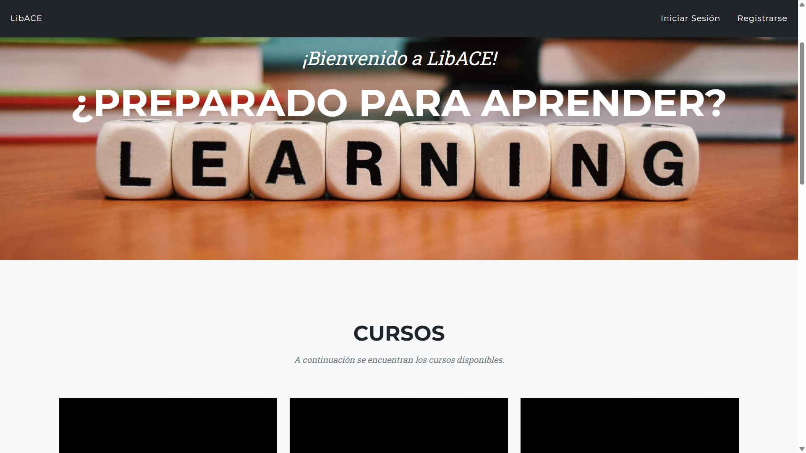
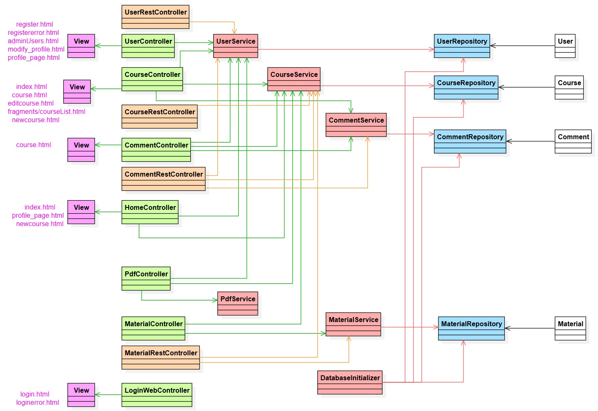

# LibACE

<h2>Index</h2>

- [Introduction](#introduction)
- [Development team](#team)
- [Web features](#features)
  - [Entities](#entities)
  - [User permissions](#permissons)
  - [Images](#images)
  - [Charts](#charts)
  - [Complementary technology](#complementary_technology)
  - [Advanced algorithms](#algorithm)
  - [Trello](#trello)
  - [Screenshots](#screenshots)
  - [Navigation](#navigation)
  - [Classes and Templates Diagram](#classes)
  - [Members contribution](#contribution)
  - [Execution instructions](#execution)
  - [Execution instructions in remote machine](#executionRemote)
  - [API Documentation](#apiDocumentation)

 

<h2 id="intro">Introduction</h2>
<h3>LibACE</h3>

LibACE is a web application where you can access courses

 
<h2 id="team">Development team</h2>

|             Member             |                Mail                |                       Git username                        |
| :----------------------------: | :--------------------------------: | :-------------------------------------------------------: |
|      Sergio Rodríguez Gil      | s.rodriguezgi.2021@alumnos.urjc.es |           [NeoDaru](https://github.com/NeoDaru)           |
|     David Cereceda Catalán     |  d.cereceda.2021@alumnos.urjc.es   | [DavidCCGithubURJC](https://github.com/DavidCCGithubURJC) |
| Marcos Alejandro Pascual Rojas |  ma.pascual.2020@alumnos.urjc.es   |           [Markos9](https://github.com/Markos9)           |
|      Sergio Lopez Cuesta       |   s.lopezc.2018@alumnos.urjc.es    |    [sergio2000-hub](https://github.com/sergio2000-hub)    |
|    Gonzalo García Castillo     |      g.garciac.2022@gmail.com      |     [g-garciac2022](https://github.com/g-garciac2022)     |

 

<h2 id="features">Web Features</h2>

<h3 id="entities">Entities</h3>

**Users**

UNREGISTERED USER: Has the ability to view all available courses on the website, and the option to log in/register.

REGISTERED USER: In addition to access all available courses, they can access the content of the courses. They can also add comments on the courses and modify their profile.

ADMIN (MANAGE/EDIT COURSES, CREATE/DELETE): Has the ability to add, delete, and modify courses and comments. They also can see the information of all courses and the ability to delete users.

**Courses**

Users can view courses, admins can create, modify and delete courses

**Comment**

The courses have comments, comments can be created by registered users

**Material**

Admins can add materials to the courses

 

<h3 id="entities_diagram">Entities diagram</h3>

<h3 id="permissons">User permissions</h3>

|                 Feature                  | Unregistered User | Registered User | Admin |
| :--------------------------------------: | :---------------: | :-------------: | :---- |
|          See available courses           |        ✅         |       ✅        | ✅    |
|              Create courses              |        ❌         |       ❌        | ✅    |
|               Edit courses               |        ❌         |       ❌        | ✅    |
|              Delete courses              |        ❌         |       ❌        | ✅    |
|         Add material to courses          |        ❌         |       ❌        | ✅    |
|            Create an account             |        ✅         |       ❌        | ❌    |
|                  Log in                  |        ✅         |       ✅        | ✅    |
| View charts and statistics about courses |        ✅         |       ✅        | ✅    |
|             Delete accounts              |        ❌         |       ❌        | ✅    |
|              Join a course               |        ❌         |       ✅        | ✅    |
|             Download diploma             |        ❌         |       ✅        | ✅    |
|         See material of courses          |        ❌         |       ✅        | ✅    |
|        Write comments in courses         |        ❌         |       ✅        | ✅    |

<h3 id="images">Images</h3>

**Images of courses**

**User profile pictures**

<h3 id="charts">Charts</h3>

**Number of users chart**

The chart shows the courses with the most users currently

<h3 id="complementary_technology">Complementary technology</h3>

**Generate Diploma PDF**

When the user finish a course, he can generate a Diploma in PDF

<h3 id="algorithm">Advanced algorithms</h3>

**Filter system**

An algorithm to filter courses based on a tag provided by the user.

 

<h3 id="trello">Trello</h3>

- [Trello](https://trello.com/b/rYpLm9YG/daw-grupo-3)

<h3 id="screenshots">Screenshots</h3>

<h4 id="index">Index</h4>

<h4 id="login">Login</h4>

<h4 id="register">Register</h4>

<h4 id="createCourse">Create course</h4>

<h4 id="adminUsers">Users list</h4>

<h4 id="course">Course</h4>

<h4 id="profilePage">Profile page</h4>

<h4 id="modifyProfile">Modify profile</h4>

<h4 id="error1">Login error</h4>

<h4 id="error2">Register error</h4>

<h4 id="error3">Course access error</h4>

<h4 id="error4">Generic error</h4>

<h3 id="navigation">Navigation diagram</h3>

<h3 id="classes">Classes and Templates Diagram</h3>

<h3 id="contribution">Members contribution</h3>

<h3>David Cereceda Catalán</h3>

I have mainly been concerned with initializing the database with default data, implementing the course comments, and implementing the graph that shows the courses with the most users.

| Commit | Description |
| :----: | :---------: |
|   [1º](https://github.com/CodeURJC-DAW-2024-25/webapp03/commit/ae082b63a87d8a90743a9f1a266e2ddd65c611e7)   | Updated DatabaseInitializer |
|   [2º](https://github.com/CodeURJC-DAW-2024-25/webapp03/commit/2d04deb3b781420561521f4a1d373609bf9afba7)   | Separated WebController into different controllers |
|   [3º](https://github.com/CodeURJC-DAW-2024-25/webapp03/commit/58a981e1451f95a19c046b75d048acf6b41d2a24)   | Comments implemented |
|   [4º](https://github.com/CodeURJC-DAW-2024-25/webapp03/commit/d343f83ff8809d0854ff878a5368a4970b3e135f)   | Fixed chart |
|   [5º](https://github.com/CodeURJC-DAW-2024-25/webapp03/commit/08e71f1d4783108a4365825516b53c3360c4adcd)   | Updated models and added DBInitializer (not finished) |

| File | Name |
| :--: | :--: |
|  [1º](https://github.com/CodeURJC-DAW-2024-25/webapp03/blob/main/backend/src/main/java/es/webapp03/backend/service/DatabaseInitializer.java)  | DatabaseInitializer.java |
|  [2º](https://github.com/CodeURJC-DAW-2024-25/webapp03/blob/main/backend/src/main/java/es/webapp03/backend/controller/CommentController.java)  | CommentController.java |
|  [3º](https://github.com/CodeURJC-DAW-2024-25/webapp03/blob/main/backend/src/main/java/es/webapp03/backend/controller/CourseController.java)  | CourseController.java |
|  [4º](https://github.com/CodeURJC-DAW-2024-25/webapp03/commits/main/backend/src/main/java/es/webapp03/backend/service/CourseService.java)  | CourseService.java |
|  [5º](https://github.com/CodeURJC-DAW-2024-25/webapp03/blob/main/backend/src/main/java/es/webapp03/backend/controller/WebController.java)  | WebController.java |

<h3>Sergio Rodríguez Gil</h3>

At the beginning of the project I created the DTOs and basic DTOs, added the security files needed for the API REST, and implemented the mappers. Apart from that, I was responsible to adapt the services to the API REST.

|                                                 Commit                                                 |                   Description                   |
| :----------------------------------------------------------------------------------------------------: | :---------------------------------------------: |
| [1º](https://github.com/CodeURJC-DAW-2024-25/webapp03/commit/beb290aa847abc904bc1d9c83d7a0f8b0662c4c3) |             Add mappers to dto folder             |
| [2º](https://github.com/CodeURJC-DAW-2024-25/webapp03/commit/360f6e3ec7db9028296a329dee335678f2c5cadc) |     Refactor UserService to use DTOs     |
| [3º](https://github.com/CodeURJC-DAW-2024-25/webapp03/commit/09716c8c8d4a705263da18650530b42dfa867d9e) |      Refactor MaterialService to use DTOs       |
| [4º](https://github.com/CodeURJC-DAW-2024-25/webapp03/commit/1ac3d071fe34c95aff79d054291397058795c7d3) |    Modify CommentService to work with dtos     |
| [5º](https://github.com/CodeURJC-DAW-2024-25/webapp03/commit/886e206f7758936ebbaa5f2def94de677e1037b1) | Create DTOs and BasicDTOs |

|                                                                    File                                                                     |        Name         |
| :-----------------------------------------------------------------------------------------------------------------------------------------: | :-----------------: |
|  [1º](https://github.com/CodeURJC-DAW-2024-25/webapp03/blob/main/backend/src/main/java/es/webapp03/backend/service/CourseService.java)   |    CourseService    |
| [2º](https://github.com/CodeURJC-DAW-2024-25/webapp03/blob/main/backend/src/main/java/es/webapp03/backend/service/UserService.java) | UserService |
| [3º](https://github.com/CodeURJC-DAW-2024-25/webapp03/blob/main/backend/src/main/java/es/webapp03/backend/service/MaterialService.java) |  MaterialService   |
|  [4º](https://github.com/CodeURJC-DAW-2024-25/webapp03/blob/main/backend/src/main/java/es/webapp03/backend/service/CommentService.java)  |   CommentService    |
| [5º](https://github.com/CodeURJC-DAW-2024-25/webapp03/blob/main/backend/src/main/java/es/webapp03/backend/dto/CourseMapper.java)  |   CourseMapper   |

<h3>Sergio López Cuesta</h3>

I implemented all the Comment Logic for the REST API

|                                                                    File                                                                           |        Name             |
| :-----------------------------------------------------------------------------------------------------------------------------------------:       | :-----------------:     |
| [1º](https://github.com/CodeURJC-DAW-2024-25/webapp03/blob/main/backend/src/main/java/es/webapp03/backend/controller/CommentRestController.java)  |  CommentRestController  |
| [2º](https://github.com/CodeURJC-DAW-2024-25/webapp03/blob/main/backend/src/main/java/es/webapp03/backend/service/CouresService.java)             |     CommentService      |
| [3º](https://github.com/CodeURJC-DAW-2024-25/webapp03/blob/main/backend/src/main/java/es/webapp03/backend/DTO/CommentDTO.java)                    |      CommentDTO         |
|  [4º](https://github.com/CodeURJC-DAW-2024-25/webapp03/blob/main/backend/src/main/java/es/webapp03/backend/service/CourseService.java)            |    CourseService        |

|                                                                    Commit                                                                   |        Description                  |
| :-----------------------------------------------------------------------------------------------------------------------------------------: | :-----------------: |
|  [1º](https://github.com/CodeURJC-DAW-2024-25/webapp03/commit/b859e2360ab297671336dc8c62837d128d335a66)                                     |    CommentRestController started    |
| [2º](https://github.com/CodeURJC-DAW-2024-25/webapp03/commit/145656ab43333a37452cced3179f1d9e39d185f9)                                      |   CommentRestController uptade      |
| [3º](https://github.com/CodeURJC-DAW-2024-25/webapp03/commit/722107e3f8c9a78852611c3d51014b9dd2a967da)                                      |    CommentRestController started    |
|  [4º](https://github.com/CodeURJC-DAW-2024-25/webapp03/commit/145656ab43333a37452cced3179f1d9e39d185f9)                                     |      Created DTO Files              |
| [5º](https://github.com/CodeURJC-DAW-2024-25/webapp03/commit/03c5d86259a0fae150a9a97c706274d1bbd5e4b8)                                      |      Fixed minor changes            |

<h3>Marcos Alejandro Pascual Rojas</h3>
I worked implementing the CourseRestController and the MaterialRestController. I also modify their respective services.

|                                                 Commit                                                 |                Description                 |
|:------------------------------------------------------------------------------------------------------:|:------------------------------------------:|
| [1º](https://github.com/CodeURJC-DAW-2024-25/webapp03/commit/7df4189bbfdb902c20dbe609c91a2e8195089871) | Updated Course Service and CourseContrller |
| [2º](https://github.com/CodeURJC-DAW-2024-25/webapp03/commit/73c822980f3b1df2d4616629108320a994acd143) |         Fixed courseRestController         |
| [3º](https://github.com/CodeURJC-DAW-2024-25/webapp03/commit/73f09c2f6e81b59f27eb97f025241f60a9de3016) |    Fixed MaterialRestController upload     |
| [4º](https://github.com/CodeURJC-DAW-2024-25/webapp03/commit/9b08135fb0fb781fa1fe3cc523c54755fa2ced35) |  Implemented MaterialRest and CourseRest   |
| [5º](https://github.com/CodeURJC-DAW-2024-25/webapp03/commit/0313f0b237bc3050ef8fdea205b473514920b810) |                 Fixed urls                 |

|                                                                         File                                                                          |              Name              |
| :---------------------------------------------------------------------------------------------------------------------------------------------------: |:------------------------------:|
|     [1º](https://github.com/CodeURJC-DAW-2024-25/webapp03/blob/main/backend/src/main/java/es/webapp03/backend/controller/CourseRestController.java)     |      CourseRestController      |
|      [2º](https://github.com/CodeURJC-DAW-2024-25/webapp03/blob/main/backend/src/main/java/es/webapp03/backend/controller/MaterialRestController.java)      |        MaterialRestController        |
|       [3º](https://github.com/CodeURJC-DAW-2024-25/webapp03/blob/main/backend/src/main/java/es/webapp03/backend/service/CourseService.java)       |         CourseService         |
|      [4º](https://github.com/CodeURJC-DAW-2024-25/webapp03/blob/main/backend/src/main/java/es/webapp03/backend/service/MaterialService.java)       |       MaterialService        |
| [5º](https://github.com/CodeURJC-DAW-2024-25/webapp03/blob/main/backend/src/main/java/es/webapp03/backend/dto/CourseDTO.java) |  CourseBasicDTO  |

<h3>Gonzalo García Castillo</h3>

My job consisted mostly in implementing the API logic for the UserRestController (and by so creating new DTOs), documenting the API using Open-API, and update the class diagram.

|                                                 Commit                                                 |                                 Description                                  |
| :----------------------------------------------------------------------------------------------------: | :--------------------------------------------------------------------------: |
| [1º](https://github.com/CodeURJC-DAW-2024-25/webapp03/commit/31e43b753ca1fc82082df84f4d8959193d792aec) |      Add OpenAPI generator configuration and update UserRestController       |
| [2º](https://github.com/CodeURJC-DAW-2024-25/webapp03/commit/c1d53831b164b50af9c4d3d6d29e4f1e8d153537) |          Add UserProfileDTO and UserRestController for user management       |
| [3º](https://github.com/CodeURJC-DAW-2024-25/webapp03/commit/8cbfff9aeae53149db42057c3b27f4d985608cc4) | refactor UserRestController and related DTOs to use UserNoImageDTO; remove UserProfileDTO       |
| [4º](https://github.com/CodeURJC-DAW-2024-25/webapp03/commit/fdf1a3747daf492b97efc672f24bccc2b506188f) |        Update pom.xml to add OpenAPI and HTML documentation generation plugins        |
| [5º](https://github.com/CodeURJC-DAW-2024-25/webapp03/commit/fbc406d906d8331eb3ccb5d133a12b2074eb119e) | Refactor PDF generation logic into PdfService|

|                                                                   File                                                                   |     Name      |
| :--------------------------------------------------------------------------------------------------------------------------------------: | :-----------: |
| [1º](https://github.com/CodeURJC-DAW-2024-25/webapp03/blob/main/backend/src/main/java/es/webapp03/backend/controller/UserRestController.java) | UserRestController |
|    [2º](https://github.com/CodeURJC-DAW-2024-25/webapp03/blob/main/backend/src/main/java/es/webapp03/backend/dto/UserNoImageDTO.java)    |  UserNoImageDTO   |
| [3º](https://github.com/CodeURJC-DAW-2024-25/webapp03/blob/main/backend/src/main/java/es/webapp03/backend/service/UserService.java) | UserService |
|            [4º](https://github.com/CodeURJC-DAW-2024-25/webapp03/blob/main/backend/src/main/java/es/webapp03/backend/dto/UserMapper.java)            | UserMapper |
|            [5º](https://github.com/CodeURJC-DAW-2024-25/webapp03/blob/main/backend/pom.xml)             |  pom.xml  |

<h2 id="execution">Execution instructions</h2>

1. Install VSCode
2. Install Java, Maven and Spring Boot extensions in VSCode
3. Download MySQL and MySQL Workbench (use "password" as your password). Create a schema named "libace"
4. Download this repository code and execute it on VSCode (is easier with the Spring Boot Dashboard extension)
5. Introduce this URL in your browser (it will tell you its not secure, but that just because its on development, nothing to worry about): https://localhost:8443/

<h2 id=executionRemote>Execution instructions in remote machine</h2>

1. Connect to the remote machine: Run ssh -i ssh-keys/appWeb03.key in GitBash from the appWeb03 folder containing the ssh-keys folder and type yes if a warning message appears.
2. Run git clone https://github.com/CodeURJC-DAW-2024-25/webapp03
3. Access the docker directory with cd webapp03/docker
4. Run docker compose up -d
5. Access the URL https://appweb03.dawgis.etsii.urjc.es/ in any browser

<h2 id=apiDocumentation>API Documentation</h2>
[API Documentation (HTML)](https://github.com/CodeURJC-DAW-2024-25/webapp03/blob/main/backend/api-docs/api-docs.html)
[API Documentation (YAML)](https://github.com/CodeURJC-DAW-2024-25/webapp03/blob/main/backend/api-docs/api-docs.yaml)
