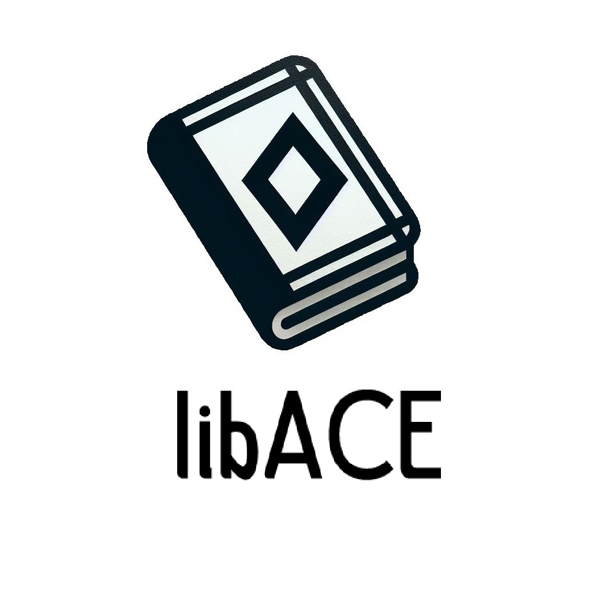

# LibACE

[Video Demo](https://youtu.be/J9MKhOOcBUQ)

<h2>Index</h2>

- [Introduction](#introduction)
- [Development team](#team)
- [Web features](#features)
  - [Entities](#entities)
  - [User permissions](#permissons)
  - [Images](#images)
  - [Charts](#charts)
  - [Complementary technology](#complementary_technology)
  - [Advanced algorithms](#algorithm)
  - [Trello](#trello)
  - [Screenshots](#screenshots)
  - [Navigation](#navigation)
  - [Classes and Templates Diagram](#classes)
  - [Members contribution](#contribution)
  - [Execution instructions](#execution)
  - [Execution instructions in remote machine](#executionRemote)
  - [API Documentation](#apiDocumentation)
  - [Execution instructions with Angular](#executionAngular)

 

<h2 id="intro">Introduction</h2>
<h3>LibACE</h3>

LibACE is a web application where you can access courses

 
<h2 id="team">Development team</h2>

|             Member             |                Mail                |                       Git username                        |
| :----------------------------: | :--------------------------------: | :-------------------------------------------------------: |
|      Sergio Rodríguez Gil      | s.rodriguezgi.2021@alumnos.urjc.es |           [NeoDaru](https://github.com/NeoDaru)           |
|     David Cereceda Catalán     |  d.cereceda.2021@alumnos.urjc.es   | [DavidCCGithubURJC](https://github.com/DavidCCGithubURJC) |
| Marcos Alejandro Pascual Rojas |  ma.pascual.2020@alumnos.urjc.es   |           [Markos9](https://github.com/Markos9)           |
|      Sergio Lopez Cuesta       |   s.lopezc.2018@alumnos.urjc.es    |    [sergio2000-hub](https://github.com/sergio2000-hub)    |
|    Gonzalo García Castillo     |      g.garciac.2022@gmail.com      |     [g-garciac2022](https://github.com/g-garciac2022)     |

 

<h2 id="features">Web Features</h2>

<h3 id="entities">Entities</h3>

**Users**

UNREGISTERED USER: Has the ability to view all available courses on the website, and the option to log in/register.

REGISTERED USER: In addition to access all available courses, they can access the content of the courses. They can also add comments on the courses and modify their profile.

ADMIN (MANAGE/EDIT COURSES, CREATE/DELETE): Has the ability to add, delete, and modify courses and comments. They also can see the information of all courses and the ability to delete users.

**Courses**

Users can view courses, admins can create, modify and delete courses

**Comment**

The courses have comments, comments can be created by registered users

**Material**

Admins can add materials to the courses

 

<h3 id="entities_diagram">Entities diagram</h3>

<h3 id="permissons">User permissions</h3>

|                 Feature                  | Unregistered User | Registered User | Admin |
| :--------------------------------------: | :---------------: | :-------------: | :---- |
|          See available courses           |        ✅         |       ✅        | ✅    |
|              Create courses              |        ❌         |       ❌        | ✅    |
|               Edit courses               |        ❌         |       ❌        | ✅    |
|              Delete courses              |        ❌         |       ❌        | ✅    |
|         Add material to courses          |        ❌         |       ❌        | ✅    |
|            Create an account             |        ✅         |       ❌        | ❌    |
|                  Log in                  |        ✅         |       ✅        | ✅    |
| View charts and statistics about courses |        ✅         |       ✅        | ✅    |
|             Delete accounts              |        ❌         |       ❌        | ✅    |
|              Join a course               |        ❌         |       ✅        | ✅    |
|             Download diploma             |        ❌         |       ✅        | ✅    |
|         See material of courses          |        ❌         |       ✅        | ✅    |
|        Write comments in courses         |        ❌         |       ✅        | ✅    |

<h3 id="images">Images</h3>

**Images of courses**

**User profile pictures**

<h3 id="charts">Charts</h3>

**Number of users chart**

The chart shows the courses with the most users currently

<h3 id="complementary_technology">Complementary technology</h3>

**Generate Diploma PDF**

When the user finish a course, he can generate a Diploma in PDF

<h3 id="algorithm">Advanced algorithms</h3>

**Filter system**

An algorithm to filter courses based on a tag provided by the user.

 

<h3 id="trello">Trello</h3>

- [Trello](https://trello.com/b/rYpLm9YG/daw-grupo-3)

<h3 id="screenshots">Screenshots</h3>

<h4 id="index">Index</h4>

<h4 id="login">Login</h4>

<h4 id="register">Register</h4>

<h4 id="createCourse">Create course</h4>

<h4 id="adminUsers">Users list</h4>

<h4 id="course">Course</h4>

<h4 id="profilePage">Profile page</h4>

<h4 id="modifyProfile">Modify profile</h4>

<h4 id="error1">Login error</h4>

<h4 id="error2">Register error</h4>

<h4 id="error3">Course access error</h4>

<h4 id="error4">Generic error</h4>

<h3 id="navigation">Navigation diagram</h3>

<h3 id="classes">Classes and Templates Diagram</h3>

<h3 id="contribution">Members contribution</h3>

<h3>David Cereceda Catalán</h3>

I have mainly been in charge of Docker and the deployment of the web application on the remote machine, and I have also helped with whatever was missing from the API.

|                                                 Commit                                                 |                                    Description                                     |
| :----------------------------------------------------------------------------------------------------: | :--------------------------------------------------------------------------------: |
| [1º](https://github.com/CodeURJC-DAW-2024-25/webapp03/commit/995a9524aac0ca4ef811be9c864154574f9c569f) |              Added Dockerfile, docker-compose.yml and create_image.sh              |
| [2º](https://github.com/CodeURJC-DAW-2024-25/webapp03/commit/01410986648f5c5e5892b620009c4d15aad0ea43) |                                Fixed course screen                                 |
| [3º](https://github.com/CodeURJC-DAW-2024-25/webapp03/commit/db144aea2829fe8e4cde0659e3f9104388e8b6c3) |                                    Fixed chart                                     |
| [4º](https://github.com/CodeURJC-DAW-2024-25/webapp03/commit/860f44f6418af2067a8984517bdc83397f11c869) |                                 chartdata from API                                 |
| [5º](https://github.com/CodeURJC-DAW-2024-25/webapp03/commit/723b14d7388502384f883152e66a0ec62c797b37) | Added execution instructiones in remote machine and api documentation to README.md |

|                                                                      File                                                                       |           Name            |
| :---------------------------------------------------------------------------------------------------------------------------------------------: | :-----------------------: |
|                           [1º](https://github.com/CodeURJC-DAW-2024-25/webapp03/blob/main/docker/docker-compose.yml)                            |    docker-compose.yml     |
|                             [2º](https://github.com/CodeURJC-DAW-2024-25/webapp03/blob/main/docker/create_image.sh)                             |      create_image.sh      |
|                               [3º](https://github.com/CodeURJC-DAW-2024-25/webapp03/blob/main/docker/Dockerfile)                                |        Dockerfile         |
| [4º](https://github.com/CodeURJC-DAW-2024-25/webapp03/blob/main/backend/src/main/java/es/webapp03/backend/controller/CourseRestController.java) | CourseRestController.java |
|   [5º](https://github.com/CodeURJC-DAW-2024-25/webapp03/blob/main/backend/src/main/java/es/webapp03/backend/controller/CourseController.java)   |   CourseController.java   |

<h3>Sergio Rodríguez Gil</h3>

I was responsible for implementing everything related to the modify profile page, and a part of the profile page. Being able to redirect the user when accessing this pages without being authenticated was also my job.

|                                                 Commit                                                 |               Description               |
| :----------------------------------------------------------------------------------------------------: | :-------------------------------------: |
| [1º](https://github.com/CodeURJC-DAW-2024-25/webapp03/commit/c4c2cba8a02e9d9f45b6aba251ddfd9355bfbda4) |        Redirects to login when not authenticated        |
| [2º](https://github.com/CodeURJC-DAW-2024-25/webapp03/commit/13321a3ee6a3e8699a44e4ce33132bf470613b9d) |    Modify profile works excluding image update     |
| [3º](https://github.com/CodeURJC-DAW-2024-25/webapp03/commit/b8bf8d3f6d39f9e6e4fc319bcae5cdb94071d485) |  Change edit profile page appearance   |
| [4º](https://github.com/CodeURJC-DAW-2024-25/webapp03/commit/d0975a2503f4c6b95bc6b7535c8f5e732cef0b89) | Working redirection to edit profile page |
| [5º](https://github.com/CodeURJC-DAW-2024-25/webapp03/commit/33cdb28f0d2062ae94826941a12ed901513c6347) |        Fix modify profile image        |

|                                                                  File                                                                   |      Name       |
| :-------------------------------------------------------------------------------------------------------------------------------------: | :-------------: |
|  [1º](https://github.com/CodeURJC-DAW-2024-25/webapp03/blob/main/frontend/libace/src/app/components/modify-profile/modify-profile.component.ts)  |  modify-profile.component  |
|   [2º](https://github.com/CodeURJC-DAW-2024-25/webapp03/blob/main/frontend/libace/src/app/components/profile-page/profile-page.component.ts)   |   profile-page.component   |
| [3º](https://github.com/CodeURJC-DAW-2024-25/webapp03/blob/main/frontend/libace/src/app/services/user.service.ts) | user.service |
| [4º](https://github.com/CodeURJC-DAW-2024-25/webapp03/blob/main/frontend/libace/src/app/components/modify-profile/modify-profile.component.html)  | modify-profile.component.html  |
|    [5º](https://github.com/CodeURJC-DAW-2024-25/webapp03/blob/main/frontend/libace/src/app/app.module.ts)     |  app.module   |

<h3>Sergio López Cuesta</h3>

I implemented all the Comment Logic for the REST API

|                                                 Commit                                                 |          Description          |
| :----------------------------------------------------------------------------------------------------: | :---------------------------: |
| [1º](https://github.com/CodeURJC-DAW-2024-25/webapp03/commit/b859e2360ab297671336dc8c62837d128d335a66) | CommentRestController started |
| [2º](https://github.com/CodeURJC-DAW-2024-25/webapp03/commit/145656ab43333a37452cced3179f1d9e39d185f9) | CommentRestController uptade  |
| [3º](https://github.com/CodeURJC-DAW-2024-25/webapp03/commit/722107e3f8c9a78852611c3d51014b9dd2a967da) | CommentRestController started |
| [4º](https://github.com/CodeURJC-DAW-2024-25/webapp03/commit/8ad3f2c0393404d7771cea7cc533304120a18385) | CourseRestController Working  |
| [5º](https://github.com/CodeURJC-DAW-2024-25/webapp03/commit/03c5d86259a0fae150a9a97c706274d1bbd5e4b8) |      Fixed minor changes      |

|                                                                       File                                                                       |         Name          |
| :----------------------------------------------------------------------------------------------------------------------------------------------: | :-------------------: |
| [1º](https://github.com/CodeURJC-DAW-2024-25/webapp03/blob/main/backend/src/main/java/es/webapp03/backend/controller/CommentRestController.java) | CommentRestController |
|      [2º](https://github.com/CodeURJC-DAW-2024-25/webapp03/blob/main/backend/src/main/java/es/webapp03/backend/service/CourseService.java)       |    CommentService     |
|          [3º](https://github.com/CodeURJC-DAW-2024-25/webapp03/blob/main/backend/src/main/java/es/webapp03/backend/dto/CommentDTO.java)          |      CommentDTO       |
|      [4º](https://github.com/CodeURJC-DAW-2024-25/webapp03/blob/main/backend/src/main/java/es/webapp03/backend/service/CourseService.java)       |     CourseService     |
|   [5º](https://github.com/CodeURJC-DAW-2024-25/webapp03/blob/main/backend/src/main/java/es/webapp03/backend/controller/CourseRestController.java)| CourseRestController  |

<h3>Marcos Alejandro Pascual Rojas</h3>
I worked in the develop of the Course Page, implementing the upload, download and delete of materials, and the functionality of the comment section.

|                                                 Commit                                                 |                Description                 |
| :----------------------------------------------------------------------------------------------------: | :----------------------------------------: |
| [1º](https://github.com/CodeURJC-DAW-2024-25/webapp03/commit/ef3277257a44c61e5c250dda7645d107c0a9ea54) |    Added course component and template     |
| [2º](https://github.com/CodeURJC-DAW-2024-25/webapp03/commit/ba703d32aa416f152a00c17d1c67a4e20000204d) |  Course page shows corresponding materials |
| [3º](https://github.com/CodeURJC-DAW-2024-25/webapp03/commit/2724bb9fc4302443e375f125b62094670e1df930) |    Feature show comments in course page    |
| [4º](https://github.com/CodeURJC-DAW-2024-25/webapp03/commit/1cee3800917874436bb7fa9da5bf671db37a70fc) |      Feature users can add comments        |
| [5º](https://github.com/CodeURJC-DAW-2024-25/webapp03/commit/1d89624d13824f8c3087f1ff8abe68e5bf63d71e) |     Feature admin can delete comments      |

|                                                                       File                                                                        |          Name          |
| :-----------------------------------------------------------------------------------------------------------------------------------------------: | :--------------------: |
| [1º](https://github.com/CodeURJC-DAW-2024-25/webapp03/blob/main/frontend/libace/src/app/services/comment.service.ts)                              |    comment.service     |
| [2º](https://github.com/CodeURJC-DAW-2024-25/webapp03/blob/main/frontend/libace/src/app/services/course.service.ts)                               |    course.service      |
| [3º](https://github.com/CodeURJC-DAW-2024-25/webapp03/blob/main/frontend/libace/src/app/services/material.service.ts)                             |    material.service    |
| [4º](https://github.com/CodeURJC-DAW-2024-25/webapp03/blob/main/frontend/libace/src/app/components/course/course.component.ts)                    |    course.component    |
| [5º](https://github.com/CodeURJC-DAW-2024-25/webapp03/blob/main/backend/src/main/java/es/webapp03/backend/controller/CommentRestController.java)  |  CommentRestController |

<h3>Gonzalo García Castillo</h3>

My job consisted mostly in implementing the logic behind registrations and user profile (creating the neccesary service), while also update the class diagram and fixing minor issues.

|                                                 Commit                                                 |                                        Description                                        |
| :----------------------------------------------------------------------------------------------------: | :---------------------------------------------------------------------------------------: |
| [1º](https://github.com/CodeURJC-DAW-2024-25/webapp03/commit/9e8313b8c2fec4ba3b79e1370c4b44726100e248) |             Implement registration form and service integration             |
| [2º](https://github.com/CodeURJC-DAW-2024-25/webapp03/commit/43608de1660172f68214541092c45f1989ee57cb) |               Add profile page component and user service integration               |
| [3º](https://github.com/CodeURJC-DAW-2024-25/webapp03/commit/d292d44807a1b201fff2b3f864c0b5863d3bce82) | Fixed user image logic to use service and updated backend for fallback |
| [4º](https://github.com/CodeURJC-DAW-2024-25/webapp03/commit/cd2bc6e0d0da94ec8a6e72293db13bf65958d403) |          Fixed api call not using service          |
| [5º](https://github.com/CodeURJC-DAW-2024-25/webapp03/commit/9d24a8f3e49fee3fd73f20c9a02627386c409a4d) |                       Refactor course component to use getters for login and admin status                       |

|                                                                     File                                                                      |        Name        |
| :-------------------------------------------------------------------------------------------------------------------------------------------: | :----------------: |
| [1º](https://github.com/CodeURJC-DAW-2024-25/webapp03/frontend/libace/src/app/services/user.service.ts) | user.service.ts |
|      [2º](https://github.com/CodeURJC-DAW-2024-25/webapp03/frontend/libace/src/app/components/register/register.component.ts)       |   register.component.ts   |
|      [3º](https://github.com/CodeURJC-DAW-2024-25/webapp03/frontend/libace/src/app/components/register/register.component.html)      |    register.component.html     |
|        [4º](https://github.com/CodeURJC-DAW-2024-25/webapp03/frontend/libace/src/app/dtos/user.dto.ts)         |     user.dto.ts     |
|                               [5º](https://github.com/CodeURJC-DAW-2024-25/webapp03/frontend/libace/src/app/components/profile-page/profile-page.component.ts)                                |      profile-page.component.ts       |

<h2 id="execution">Execution instructions</h2>

1. Install VSCode
2. Install Java, Maven and Spring Boot extensions in VSCode
3. Download MySQL and MySQL Workbench (use "password" as your password). Create a schema named "libace"
4. Download this repository code and execute it on VSCode (is easier with the Spring Boot Dashboard extension)
5. Introduce this URL in your browser (it will tell you its not secure, but that just because its on development, nothing to worry about): https://localhost:8443/

<h2 id=executionRemote>Execution instructions in remote machine</h2>

1. Connect to the remote machine: Run ssh -i ssh-keys/appWeb03.key in GitBash from the appWeb03 folder containing the ssh-keys folder and type yes if a warning message appears.
2. Run git clone https://github.com/CodeURJC-DAW-2024-25/webapp03
3. Access the docker directory with cd webapp03/docker
4. Give execution permissions to create_image.sh (chmod +x create_image.sh)
5. Run ./create_image.sh
6. Give execution permissions to publish_image.sh (chmod +x create_image.sh)
7. Run ./publish_image.sh
8. Run docker compose up -d
9. Access the URL https://appweb03.dawgis.etsii.urjc.es/ in any browser

<h2 id=apiDocumentation>API Documentation</h2>

[API Documentation (HTML)](https://rawcdn.githack.com/CodeURJC-DAW-2024-25/webapp03/55e2a17214ba54c940fbf87b1f1faae197d6ad89/backend/api-docs/api-docs.html)

[API Documentation (YAML)](https://github.com/CodeURJC-DAW-2024-25/webapp03/blob/main/backend/api-docs/api-docs.yaml)

[API Documentation (Link)](https://localhost:8443/swagger-ui/index.html)

<h2 id=executionAngular>Execution instructions with Angular</h2>

1. Install Angular with: npm install -g @angular/cli
2. Clone the repository: git clone https://github.com/CodeURJC-DAW-2024-25/webapp03.git
3. Access to /frontend/libace
4. Run npm install (only first time)
5. Run ng build --configuration=production
6. Copy files from /frontend/libace/dist/libace/browser to /backend/src/main/resources/static/new
7. Run backend ([Execution instructions](#execution))
8. The SPA application with Angular will be available at https://localhost:8443/new
9. To run on a remote machine, the same steps as in the previous version are followed ([Execution instructions in remote machine](#executionRemote)) and the app will be available at https://appweb03.dawgis.etsii.urjc.es/new
